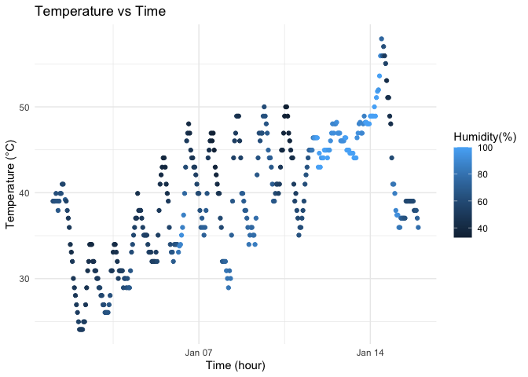

p8105_hw1_yl6104
================
Yumeng Lu
2025-09-16

## Problem 1

``` r
library(tidyverse)
```

    ## ── Attaching core tidyverse packages ──────────────────────── tidyverse 2.0.0 ──
    ## ✔ dplyr     1.1.4     ✔ readr     2.1.5
    ## ✔ forcats   1.0.0     ✔ stringr   1.5.1
    ## ✔ ggplot2   3.5.2     ✔ tibble    3.3.0
    ## ✔ lubridate 1.9.4     ✔ tidyr     1.3.1
    ## ✔ purrr     1.0.4     
    ## ── Conflicts ────────────────────────────────────────── tidyverse_conflicts() ──
    ## ✖ dplyr::filter() masks stats::filter()
    ## ✖ dplyr::lag()    masks stats::lag()
    ## ℹ Use the conflicted package (<http://conflicted.r-lib.org/>) to force all conflicts to become errors

``` r
library(moderndive)
data("early_january_weather")
help("early_january_weather")
```

The data contains 358 rows and 15 columns.

Variables include origin, year, month, day, hour, temp, dewp, humid,
wind_dir, wind_speed, wind_gust, precip, pressure, visib, time_hour.

Variables include:

- `origin` (character): airport code, e.g., `"EWR"`  
- `year` (numeric): all values are 2013  
- `month` (numeric): all values are 1 (January)  
- `day` (numeric): day of the month, range 1–15  
- `hour` (numeric): hour of observation, range 0–23  
- `temp` (numeric): temperature in °F; min = 24.08, max = 57.92, mean =
  39.58 **important variable**  
- `dewp` (numeric): dew point in °F; min = 8.96, max = 53.06, mean =
  28.06  
- `humid` (numeric): relative humidity %; min = 32.86, max = 100, mean =
  65.48 **important variable for plotting**  
- `wind_dir` (numeric): wind direction in degrees; min = 0, max = 360  
- `wind_speed` (numeric): wind speed and gust speed in mph; min = 0, max
  = 24.17  
- `wind_gust` (numeric): wind gust speed in mph; many NAs (308)  
- `precip` (numeric): precipitation in inches; min = 0, max = 0.19,
  mostly 0  
- `pressure` (numeric): sea level pressure in millibars; min = 1011, max
  = 1034  
- `visib` (numeric): visibility in miles; min = 0.12, max = 10  
- `time_hour` (POSIXct): date and hour of the recording as a POSIXct
  date; range 2013-01-01 01:00:00 – 2013-01-15 23:00:00 **important for
  x-axis**

The mean temperature is 39.58 °F

``` r
temp_time_humi_plot = ggplot(data = early_january_weather, aes(x = time_hour, y = temp, colour = humid)) +
  geom_point() +
  labs(title = "Temperature vs Time",
       x = "Time (hour)",
       y = "Temperature (°C)", 
       color = "Humidity(%)") +
  theme_minimal()

print(temp_time_humi_plot)
```

<!-- -->

``` r
ggsave("temperature_time_humidity_scatterplot.png", plot = temp_time_humi_plot, width = 8, height = 6, dpi = 800)
```

**General Trend of Temperature over Time:**

The plot shows a clear upward trend in temperature over 2 weeks. The
temperature in the early part of January appears to be generally lower,
which fluctuates between around 25-45 F. By January 14th, the
temperature is consistently higher, ranging from 35-60 F. However there
is a sharp dropping after Jan 14th.

**Diurnal Temperature Cycle:**

There are visible temperature cycles in the upward trend. The
tempearture appers to rise in the day and drop in the night.

**Relationship Between Temperature and Humidity:**

Under lower temperatures, humidity tends to be lower and under higher
temperatures humidity tends higher.

## Problem 2

``` r
set.seed(123)

df = tibble(num_vec = rnorm(10), # a random sample of size 10 from a standard Normal distribution,
            log_vec = num_vec > 0, # a logical vector indicating whether elements of the sample are greater than 0, 
            char_vec = c("a", "b", "c", "d", "e", "f", "g", "h", "i", "j"), # a character vector of length 10, 
            fac_vec = factor(rep(c("low", "medium", "high"), length.out = 10))) # a factor vector of length 10, with 3 different factor “levels”
print(df)
```

    ## # A tibble: 10 × 4
    ##    num_vec log_vec char_vec fac_vec
    ##      <dbl> <lgl>   <chr>    <fct>  
    ##  1 -0.560  FALSE   a        low    
    ##  2 -0.230  FALSE   b        medium 
    ##  3  1.56   TRUE    c        high   
    ##  4  0.0705 TRUE    d        low    
    ##  5  0.129  TRUE    e        medium 
    ##  6  1.72   TRUE    f        high   
    ##  7  0.461  TRUE    g        low    
    ##  8 -1.27   FALSE   h        medium 
    ##  9 -0.687  FALSE   i        high   
    ## 10 -0.446  FALSE   j        low

``` r
num_mean = mean(pull(df, var = num_vec))
log_mean = mean(pull(df, var = log_vec))
char_mean = mean(pull(df, var = char_vec))
fac_mean = mean(pull(df, var = fac_vec))

cat("mean of numerical vector:", num_mean)
```

    ## mean of numerical vector: 0.07462564

``` r
cat("mean of logical vector:", log_mean)
```

    ## mean of logical vector: 0.5

``` r
cat("mean of character vector:", char_mean)
```

    ## mean of character vector: NA

``` r
cat("mean of factor vector:", fac_mean)
```

    ## mean of factor vector: NA

When taking mean, numerical and logical vector works while character and
factor vector does not.

``` r
as.numeric(pull(df, var = num_vec))
as.numeric(pull(df, var = log_vec))
as.numeric(pull(df, var = char_vec))
as.numeric(pull(df, var = fac_vec))
```

After applying as.numeric(), `numerical vector` is not changed. For
`logical vector`, `FALSE` converts to `0` and `TRUE` converts to `1`.
`Character vector` produces `NA` because characters have no inherent
numeric meaning. `Factor vector` returns the underlying integer codes of
the factor levels (e.g., `"low" "medium" "high"` → `1, 2, 3`), but the
result reflects the coding scheme, not the actual category values.

It fully explains the result of taking mean. Specifically, the mean of
the factor variable is NA because R does not allow direct arithmetic on
categorical variables. However, after converting with as.numeric(), the
factor is represented by its internal integer codes, so the mean can be
calculated.
